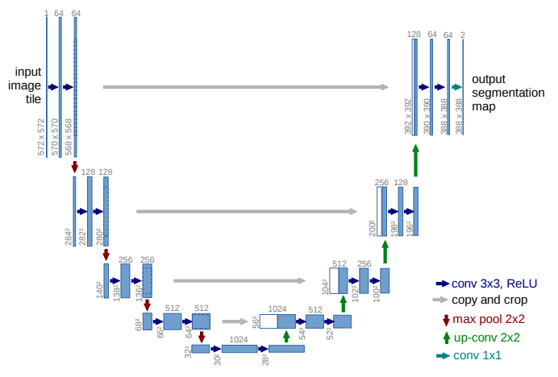
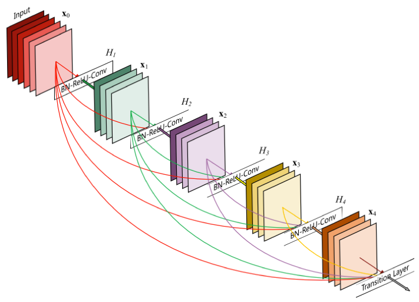
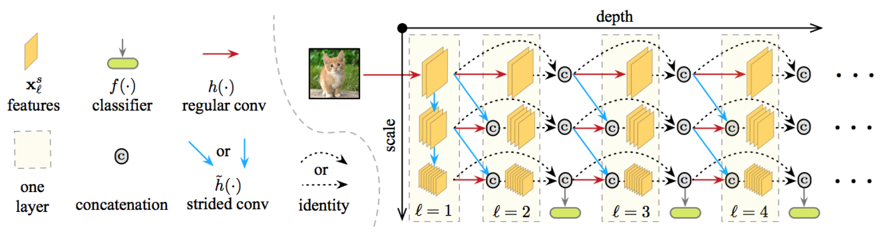
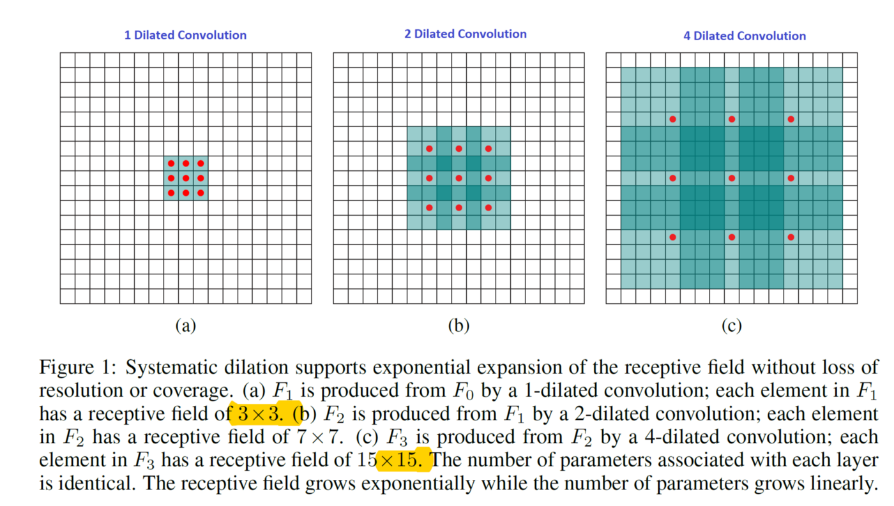

# MSDNet-Segmentation

## Overview

(Note: This repo is still a work-in-progress)

This is an image segmentation model that uses Multi-Scale Dense Networks as both Encoder and Decoder modules with one modification: rather than shifting reducing the scale by using Conv2D (stride = 2), we use Dilated Convolutions. 

The main purpose for this is to avoid annoying size constraints on the input images that occur when downsampling and then upsampling with odd numbers. Specifically, upsampling at certain scales can cause size-incompatibilities which prevent you from concatenating with layers of one scale up.

Replacing strided convolutions with dilated convolutions allows for the output of every convolution in the model to remain the same size, while still allowing for larger effective receptive fields. One side effect of this is the large amount of memory required for backpropagation - all activations from the model need to be stored for the purposes of backprogatation. Depending on the model size (number of scales and depth of model), this can exceed GPU RAM limitations. Luckily, Intel Xeon performance on training CNN's has improved by orders of magnitude over the last couple of months thanks to efforts like [MKL-DNN](https://github.com/intel/mkl-dnn), which is fully integrated with TensorFlow and MxNet (with more frameworks to follow).

### Encoder-Decoder Structures

  

Many popular segmentation models incorporate some form of Encoder-Decoder structure, in which the Encoder is a fully convolutional structure with pooling layers in between and the Decoder is also a fully convolutional structure with either naive upsampling or Transpose Convolution. 

Often times, skip connections are present between the encoder and decoder.

See [U-Net](https://arxiv.org/abs/1505.04597), [SegNet](http://mi.eng.cam.ac.uk/projects/segnet/), [FC-DenseNet](https://arxiv.org/abs/1611.09326) for some examples of different segmentation models.

### Dense Connectivity

  

[DenseNets](https://arxiv.org/abs/1608.06993) use channel concatenation between convolutional layers to allow for more direct gradient flow to the earlier layers. Since channel concatenation can add up, bottleneck layers are inserted between accumulated dense connections in order to reduce the depth of the output of the convolutions (as well as reduce parameter size). DenseNets have been demonstrated to have good results in image classification tasks vs ResNets / Inception. The channel concatenation also allows for lower numbers of filters in the convolutional layers, meaning that the same accuracy can be reached with lower parameters. 

### Multi-Scale DenseNets

  

Following DenseNets, Multi-scale Dense Networks add different scales (downsampling paths), which are themselves concatenated with each other but are also concanated with strided convolutions from the previous layer. Multi-Scale Dense Nets also incorporate early-exit classifiers. Using multiple scales allows for further reduction in parameters in the model. 

In this repo, the hypothesis is that MSD-Networks can function as a highly efficient encoder and decoder.

### Dilated Convolutions

  

Dilated Convolutions for multi-scale context aggregation is introduced in this [paper](https://arxiv.org/abs/1511.07122). Dilated convolutions allow for exponentially growing receptive field which is helpful in segmentation tasks.